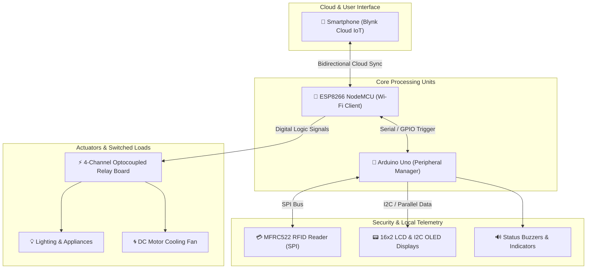

# IoT Smart Home & Security Automation System

[](https://www.arduino.cc/)
[](https://blynk.io/)
[](https://github.com/)
[](https://youtu.be/Tw8kb3kqW2Q)

An integrated IoT smart-home automation and multi-zone physical security platform engineered to facilitate accessible appliance control for elderly and differently-abled individuals while providing real-time local display feedback and secure RFID access logging. Recognized with an institutional award at Gujarat Technological University (SSPC / SSIT 2019).

---

## 📽️ Video Demonstration

[](https://youtu.be/Tw8kb3kqW2Q)

> **Direct YouTube Link:** [Home Automation Diploma Project](https://youtu.be/Tw8kb3kqW2Q)  
> *Click the thumbnail above or link to watch the live hardware demonstration showcasing cloud smartphone relay actuation, 16x2 LCD status display, DC motor cooling control, and RC522 RFID door security.*

---

## ⚠️ Challenges & Engineering Solutions

### 1. Optocoupler Relay Inrush Current & Controller Brownout
* **The Problem:** Switching multiple inductive loads (AC lights, 5V DC cooling fan, simulated TV loads) simultaneously drew sudden peak inrush currents through the 4-channel relay module, leading to voltage drops that caused the ESP8266 Wi-Fi module to disconnect and drop offline.
* **The Solution:** Separated logic and relay coil power using the onboard optocoupled `JD-VCC` isolation jumper with a dedicated 5V external power source. Added bulk smoothing capacitors across the microcontroller rail to maintain stable Wi-Fi operations during relay switching transients.

### 2. Multi-Device Pin Contention & Peripheral Offloading
* **The Problem:** The ESP8266 (NodeMCU) possesses a constrained number of digital GPIO pins, making it challenging to concurrently interface a 4-channel relay module, an RC522 SPI RFID reader, a parallel 16x2 LCD, and status LEDs without pin conflicts during boot.
* **The Solution:** Adopted a distributed dual-controller architecture: the ESP8266 managed cloud IoT socket communication (Blynk) and relay switching, while an Arduino Uno was bridged via serial communication to offload low-level polling for the RC522 RFID reader, an I2C OLED display, and a 16x2 LCD.

### 3. Remote Synchronization & Latency Reduction
* **The Problem:** High network ping or transient packet loss caused user state mismatches between physical relay status and smartphone dashboard toggle states.
* **The Solution:** Implemented bidirectional state acknowledgments in embedded C++. Relays only confirm their toggled status back to the mobile UI after reading digital feedback from the driver pins, preventing UI out-of-sync states.

### 4. RFID Card Authentication & Access Debouncing
* **The Problem:** Continuous proximity of an RFID card triggered multiple rapid read interrupts, causing false multi-taps and jitter on the door lock status.
* **The Solution:** Introduced software debounce timers and a state-machine locking latch in firmware that enforces a mandatory cooldown delay before subsequent card scans can be registered.

---

## 🌟 Key Highlights

* **Cloud-Connected Appliance Control:** Bidirectional Wi-Fi control of lights, fans, and simulated appliances from any internet connection via a customized mobile dashboard.
* **Accessible Assistive Tech Focus:** Designed with an emphasis on assistive automation for individuals with limited mobility or motor impairments.
* **Multi-Display Telemetry:** 16x2 character LCD and 0.96" I2C OLED display modules providing real-time indoor status updates, device confirmation, and welcome banners.
* **Secure RFID Door Entry:** RC522 13.56 MHz RFID reader verifying authorized credentials for electronic door actuation with automated access indication.
* **Award Recognition:** Awarded 1st place in the institutional diploma project exhibition at Swaminarayan Polytechnic (SSPC / GTU, 2019).

---

## 📐 System Architecture

---

## 🛠️ Hardware Bill of Materials (BOM)

| Component | Description | Function |
| :--- | :--- | :--- |
| **NodeMCU (ESP8266)** | 32-bit Wi-Fi Microcontroller | Cloud connectivity, Blynk IoT client, and relay output logic |
| **Arduino Uno** | ATmega328P 8-bit Microcontroller | Hardware offloader for RFID SPI polling, OLED, and 16x2 LCD |
| **4-Channel Relay Module** | Optocoupled 5V Relay Board | High-power AC/DC load switching with JD-VCC isolation |
| **RC522 RFID Module** | 13.56 MHz Contactless Reader | SPI-based authentication for smart door access control |
| **16x2 Character LCD** | HD44780 Parallel Display | Main indoor room status and welcome notification display |
| **0.96" I2C OLED Display** | 128x64 SSD1306 Display Module | Dedicated real-time door lock telemetry display |
| **DC Motor & Fan Blade** | 5V DC Motor | Automated indoor air circulation simulation |
| **Regulated Power Unit** | 5V / 3.3V DC Power Supply | Decoupled logic rails and high-current relay supply |

---

## 🔌 Pinout Mapping

### NodeMCU (ESP8266)
| Pin Designation | Connected Module | Signal Description |
| :--- | :--- | :--- |
| `D1 (GPIO5)` | Relay Module `IN1` | AC Light / Appliance 1 control |
| `D2 (GPIO4)` | Relay Module `IN2` | Plug Socket / Appliance 2 control |
| `D5 (GPIO14)` | Relay Module `IN3` | DC Cooling Fan motor control |
| `D6 (GPIO12)` | Relay Module `IN4` | Auxiliary appliance control |
| `3V3` / `GND` | Power Rails | Logic supply and ground |

### Arduino Uno
| Arduino Uno Pin | Peripheral Connection | Signal Description |
| :--- | :--- | :--- |
| `D10` | RC522 `SDA (SS)` | SPI Slave Select |
| `D11` | RC522 `MOSI` | SPI Master-Out Slave-In |
| `D12` | RC522 `MISO` | SPI Master-In Slave-Out |
| `D13` | RC522 `SCK` | SPI Clock |
| `D9` | RC522 `RST` | Hardware Reset |
| `A4` | 0.96" OLED `SDA` | I2C Data line |
| `A5` | 0.96" OLED `SCL` | I2C Clock line |
| `D2 – D7` | 16x2 LCD (`RS, E, D4-D7`) | 4-Bit Parallel Data bus |
| `5V` & `GND` | Displays & RFID VCC / GND | Logic power and common system ground |

---

## 🚀 Getting Started

### 1. Requirements
* [Arduino IDE](https://www.arduino.cc/en/software) (version 1.8.x or 2.x)
* Required Libraries: `Blynk`, `ESP8266WiFi`, `MFRC522`, `LiquidCrystal`, `Adafruit_SSD1306`

### 2. Flashing the Firmware
1. Clone this repository:
   ```bash
   git clone [https://github.com/](https://github.com/)<your-username>/iot-home-automation-security.git
   cd iot-home-automation-security
